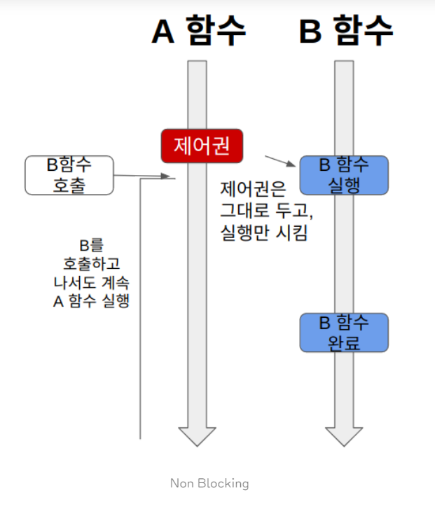
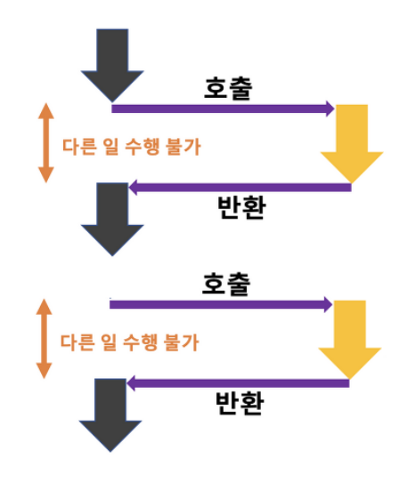
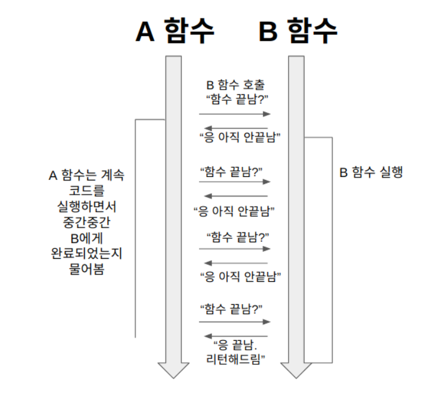
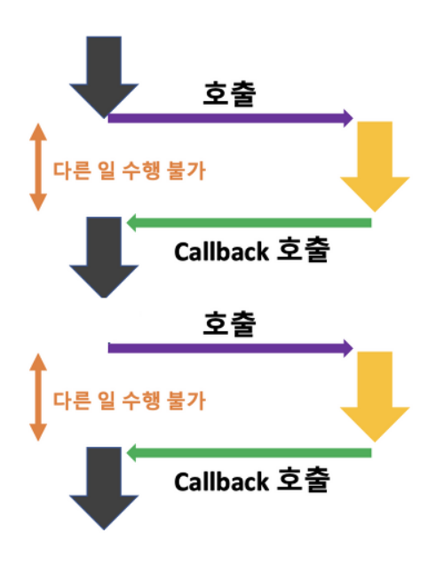

## 동기(Synchronous) / 비동기(Asynchronous)

- 작업을 순차적으로 수행할지 아닌지에 대한 관점

### 동기

- 요청한 작업에 대해 완료 여부를 따져 순차대로 처리
- 요청 따른 응답 순서가 지켜지는 것

### 비동기

- 요청한 작업에 대해 완료 여부를 따지지 않기 때문에 자신의 다음 작업을 그대로 수행
- 요청과는 무관하게 어떤 응답이 먼저일지 모름
- I/O 작업과 같은 느린 작업이 발생할 때, 기다리지 않고 다른 작업을 처리하면서 동시에 처리하여 멀티 작업을 진행할수 있기 때문에 전반적인 시스템 성능 향상에 도움을 줄 수 있다.

## Blocking / Non-Blocking

- 현재 작업이 차단, 대기 되느냐 아니냐에 따라 다른 작업을 수행할 수 있는지에 대한 관점




```javascript
console.log("시작");

setTimeout(() => {
  console.log("1초 후에 실행됩니다!");
}, 1000);

console.log("끝");
```

```
시작
끝
1초 후에 실행됩니다!
```

- setTimeout함수는 비동기 함수이자 논블로킹 함수다.

## 동기/비동기 + 블로킹/논블로킹 조합

1. Sync Blocking (동기 + 블로킹)
2. Async Blocking (비동기 + 블로킹)
3. Sync Non-Blocking (동기 + 논블로킹) 
4. Async Non-Blocking (비동기 + 논블로킹)

### 동기 + 블로킹

- Sync Blocking 조합은 다른 작업이 진행되는 동안 자신의 작업을 처리하지 않고 (Blocking), 다른 작업의 완료 여부를 바로 받아 순차적으로 처리하는 (Sync) 방식
- 다른 작업의 결과가 자신의 작업에 영향을 주는 경우에 활용할 수 있다.



- 예시
    - 파일을 읽어 처리하는 로직 <> 파일을 먼저 읽어야 그 다음 작업을 처리할 수 있기에
    - 콘솔 프로그램 실행 후 커맨드에서 입력을 받는 경우

### 비동기 + 논블로킹

- sync Non Blocking 조합은 다른 작업이 진행되는 동안에도 자신의 작업을 처리하고 (Non Blocking), 다른 작업의 결과를 바로 처리하지 않아 작업 순서가 지켜지지 않는 (Async) 방식
- 다른 작업의 결과가 자신의 작업에 영향을 주지 않은 경우에 활용할 수 있다.


- 예시
    - 웹 브라우저의 파일 다운로드

### 동기 + 논블로킹

- Sync Non-Blocking 조합은 다른 작업이 진행되는 동안에도 자신의 작업을 처리하고 (Non Blocking), 다른 작업의 결과를 바로 처리하여 작업을 순차대로 수행 하는 (Sync) 방식



- 예시
    - 자바의 쓰레드
    - 게임 맵 이동 로딩바
    - 파일을 다운로드하면 나타나는 다운로드 진행바

### 비동기 + 블로킹

- Async Blocking 조합은 다른 작업이 진행되는 동안 자신의 작업을 멈추고 기다리는 (Blocking), 다른 작업의 결과를 바로 처리하지 않아 순서대로 작업을 수행하지 않는 (Async) 방식
- Async-blocking 의 경우는 실무에서 잘 마주하기 쉽지 않아 다룰일이 거의 없다



- 동기 + 블로킹과 차이가 없다