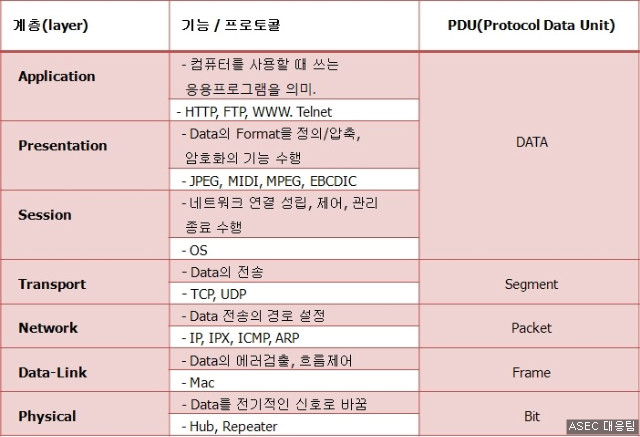
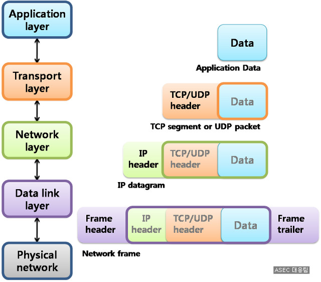
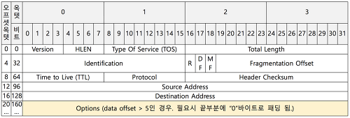
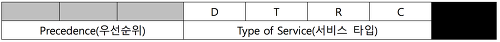

<div align=center>
  <h1> IP Header 😺 </h1>
</div>

> 발표일　　|　 2023.10.25 <br />
> 발표자　　|　강준영 <br />

<div align=center>
  <h3>📇 목차 </h3>
</div>

[1. 배경](#🏭-배경)<br />
[2. 정의](#🌊-정의)<br />
[3. 구조](#🦴-구조) <br />

<br>

# 🏭 배경

## PDU : Protocol Data Unit

각 계층에서 헤더와 데이터를 합친 부분.

즉, 계층간 통신을 할 때 사용되는 데이터 단위





주로 상위 레이어의 PDU의 앞쪽에 추가 되는 형식

<br>

# 🌊 정의

## IP(Internet Protocol)

```
  송신 호스트와 수신 호스트가 패킷 교환 네트워크에서 정보를 주고받는 데 사용하는 정보 위주의 규약(프로토콜).

  OSI 네트워크 계층에서 호스트의 주소지정과 패킷 분할 및 조립 기능을 담당.

  IP의 정보는 패킷 혹은 데이터그램이라고 하는 덩어리로 나뉘어 전송되며, 이전에 통신한 적 없는 호스트에 패킷을 보낼 때 경로 설정 필요x.

  비신뢰성(unreliability)과 비연결성(connectionlessness)이 특징.

  비신뢰성 : 흐름에 관여하지 않기 때문에 보낸 정보가 제대로 갔는지 보장하지 않음.

  패킷전송과 정확한 순서를 보장하려면 TCP 프로토콜과 같은 IP의 상위 프로토콜을 이용해야 함.
```

## IP Header

IP 데이터그램(패킷)의 앞부분에서 주소 등 각종 제어 정보를 담고 있는 부분

# 🦴 구조



- Version : 4bits IP 포맷의 버전을 나타냄. 현재 버전은 주로 IPv4가 가장 널리 쓰이며, 차세대 포맷으로 IPv6가 제안되어 조금씩 사용 범위가 늘어나고 있는 추세.

- HLEN(Header Length) : 데이터그램 헤더의 전체 길이를 4바이트 단위로 나타냄. 최소 20바이트에서 60바이트 사이의 값이 입력됨. 이 값은 Options의 크기에 의해 결정됩니다.

- Type of Service : 데이터그램이 라우터에 의해 어떻게 처리되어야 하는지 정의. 3비트의 우선 순위와 4비트의 서비스 유형(TOS)의 두 개의 서브필드로 나뉨. 1비트는 사용하지 않음.

  - 우선 순위 : 0~7 까지의 값을 갖는 3비트 길이의 서브 필드. 데이터 그램의 우선 순위를 정의하며 만약 데이터 일부를 파기해야 한다면 우선 순위가 낮은 데이터를 선 파기.

  - TOS 의 각 비트
  - 
    - D : Minimize Delay
    - T : Maximize Throughput
    - R : Maximize Reliability
    - C : Minimize Cost

- Total Length : 헤더와 데이터를 포함하는 IP 데이터그램의 전체 길이를 바이트 단위로 나타냄. 상위계층으로부터 받는 데이터 길이를 알아내기 위해서는 전체 길이에서 헤더 길이를 빼면 됨. 헤더의 길이는 HLEN 필드의 값에 4를 곱하면 됨.

- Identification :
  발신지 호스트로부터 나온 데이터그램을 유일하게 식별함. 식별자와 발신지 IP주소의 조합은 데이터그램이 발신지 호스트를 떠날 때 유일하게 정의되어야 함. 이러한 유일성을 보장하기 위해 카운터를 사용하여 데이터그램에 레이블을 붙임.
  IP 프로토콜이 데이터그램을 보낼 때 카운터의 현재 값을 식별자 필드에 복사하고 카운터 값을 1 증가시킴. 카운터 값이 주기억장치 내에 유지되는 한 유일성은 보장됨. 데이터그램이 단편화 될 때 식별자 필드의 값은 모든 단편에 복사가 되며 모든 단편은 같은 식별자 값을 가지게 됨. 식별자는 목적지에서 데이터그램을 재조립하는데 도움이 됨.

※ 단편화

```
IP에서의 데이터그램 단편화는 IP 패킷을 여러 작은 조각 또는 "단편"으로 나누는 과정
단편화는 보내는 측에서 수행되며, 수신 측에서는 이러한 단편들을 다시 조합하여 원래의 패킷을 복원함.
IP 헤더에는 단편화와 관련된 필드들이 있어, 어떤 단편인지, 전체 패킷의 일부인지, 어떤 순서로 조합해야 하는지를 나타내는 정보가 포함됨.
```

- Flags : 3bit 필드이며 첫 번째 비트는 사용되지 않음. 두 번째 비트는 DF(Do not fragment) 비트. 이 플래그의 값이 1이면 시스템은 단편화해서는 안됨. 세 번째 비트는 MF(More Fragment) 비트. 이 값이 1이면 데이터그램은 마지막 단편이 아니라는 것을 알려줌. 만약 이 값이 0이면 마지막 단편이거나 유일한 단편.

- Fragmentation Offset : 13bit 필드이며 전체 데이터그램 내에서 단편의 상대적 위치를 나타냄. 이 필드는 기존 데이터그램 내에서 데이터의 옵셋을 8바이트 단위로 나타낸 것.

- Time to Live : 데이터그램은 인터넷을 통하여 전달되는 동안 제한된 수명을 갖게됨. TTL은 데이터그램이 살아있을 시간을 지정함. IP 데이터 그램이 라우터를 경유하게 되면 라우터는 TTL 필드를 조사해서 TTL의 값에 1을 빼 줌. TTL 값이 0이 되면 라우터는 이 데이터그램을 전달하지 않고 폐기. 이는 데이터그램이 라우터 상에서 무한순환하는 사태를 예방할 수 있음.

- Protocol : IP 계층의 서비스를 사용하는 상위 계층 프로토콜을 정의. 여러 종류의 상위 계층 프로토콜을 캡슐화. 이 필드는 IP 데이터그램이 전달되어야 하는 최종 프로토콜을 나타냄. IP 프로토콜은 다른 종류의 상위 계층 프로토콜로부터 오는 데이터를 다중화 및 역 다중화하므로 데이터그램이 최종 목적지에 도달한 경우 이 필드의 값은 역다중화의 과정을 돕게됨. (ICMP : 1 / IGMP : 2 / TCP : 6 / EGP : 8 / UDP : 17 / IPv6 : 41 / OSPF : 89 )

- Header Checksum : 오류 검출을 하기 위한 값.

- Source Address : 발신지의 IP 주소를 정의.

- Destination Address : 수신지의 IP 주소를 정의.

- Options : 네트워크를 시험하거나 디버그하기 위하여 사용됨.

#### 출처

1. 패킷 뜯어 보기! - WireShark편 : https://asec.ahnlab.com/ko/156/
2. [프로토콜] IP Header : https://joycecoder.tistory.com/30
