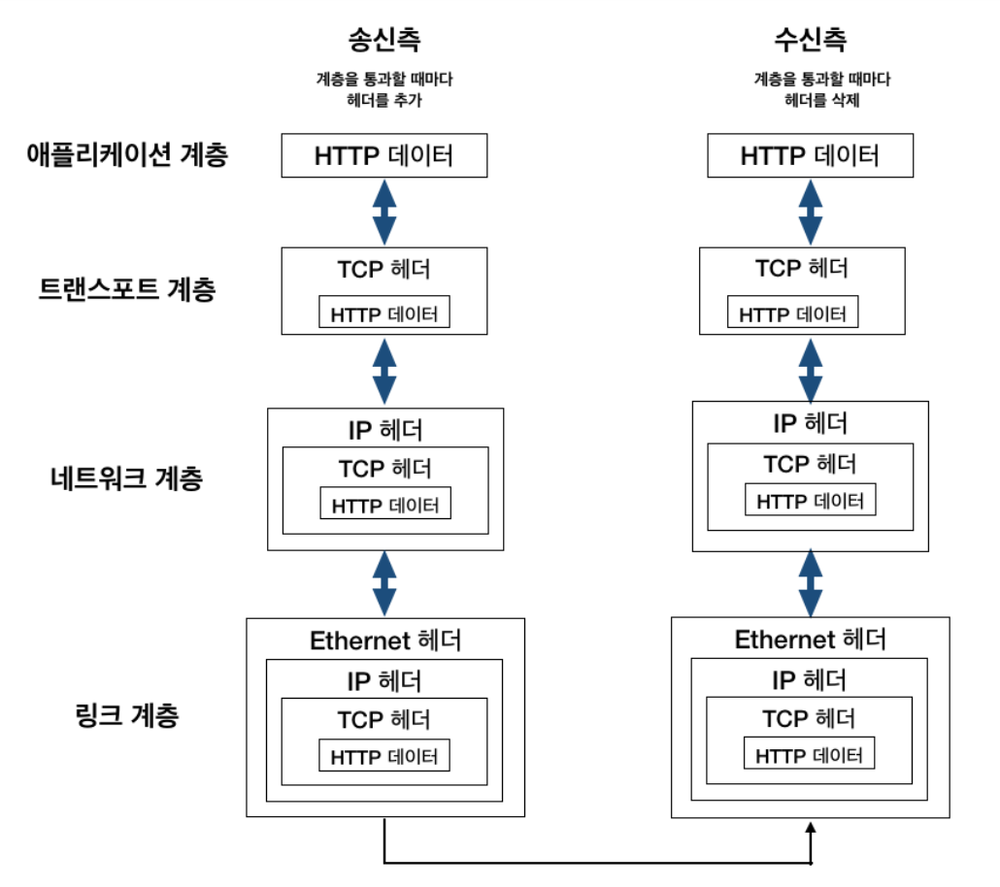

## TCP / IP 개념

### IP (인터넷 프로토콜)

- 지정한 IP 주소에 데이터의 조각들을 패킷이라는 통신 단위로 최대한 빨리 목적지로 보내는 역할.

### TCP

- 패킷 데이터의 전달읠 보증하고 보낸 순서대로 받게 해준다.
- 데이터를 확실하게 보내기 위해서 3 way 핸드쉐이킹 사용
- TCP는 IP의 문제를 보완해준다.

### TCP 3 way handshake

- 상대 클라이언트와 연결되기 전에 가상 연결을 해서 패킷을 보내서 확인하는 동작

1. 클라이언트 -> 서버: SYN 패킷 전송
2. 서버 -> 클라이언트: SYN + ACK 패킷 전송
3. 클라이언트 -> 서버: ACK + 데이터 패킷 전송

### TCP 순서 보장 방법

1. 클라이언트에서 패킷1, 패킷2, 패킷3 순서로 전송
2. 서버에서 패킷1, 패킷3, 패킷2 순서로 받음
3. 서버에서 패킷2번부터 다시 보내라고 클라이언트에게 요청

> TCP 데이터 안에 전송 제어, 순서 정보들이 있기 때문에 순서대로 제어 가능 -> 신뢰할 수 있는 프로토콜

### UDP

- 비 연결지향적 프로토콜
- 데이터 전달 보증 X
- 순서 보장 X
- IP와 거의 같다. PORT와 체크섬(메시지 검증해주는 데이터) 정도만 추가된 형태.

## TCP / IP 4계층

- 4 - 애플리케이션 계층 - HTTP, FTP, DNS, SMTP
- 3 - 전송 계층 - TCP, UDP
- 2 - 인터넷 계층 - IP
- 1 - 네트워크 액세스 계층 - Ehternet(이더넷)

### TCP / IP 4계층 종류

1. Network Layer (OSI 물리 + 데이터링크 계층)

- 노드간의 신뢰성 있는 데이터 전송을 담당
- 알맞은 하드웨어로 데이터가 전달되도록 MAC주소 핸들링, 데이터 패켓을 전기신호로 변환하여 선로를 통하여 전달할 수 있게 준비.

2. Internet Layer (OSI 네트워크 계층)

- IP를 담당
- IP를 사용하여 데이터의 발신지와 도착지에 관한 정보 첨부
- IP는 복잡한 네트워크 망을 통해 가장 효율적인 방법으로 데이터의 작은 조각들을 되도록 빨리 보내는 일을 한다.
- 따라서 패킷 전달 여부를 보증하지 않고, **경로를 설정하여 어떻게든 빨리 보내**도록 한다.

3. Transport Layer (OSI 전송 계층)

- TCP / UDP 담당
- TCP는 IP위에서 동작하는 프로토콜로 **데이터의 전달을 보증**하고 보낸 순서대로 받게 해준다.
- 순서가 맞지 않거나 중간에 빠진 부분을 점검하여 다시 요청

4. Application Layer (OSI 5,6,7 계층)

- HTTP / FTP 담당
- **서버나 클라이언트 응용 프로그램**이 이 계층에서 동작
- 브라우저나 텔넷같은 서비스가 이 계층에서 동작

### TCP / IP 4계층 동작 순서

1. 송신측 클라이언트의 애플리케이션 계층에서 어느 웹 페이지를 보고 싶다라는 HTTP 요청을 지시한다.
2. 그 다음에 있는 트랜스포트 계층에서는 애플리케이션 계층에서 받은 데이터(HTTP 메시지)를 통신하기 쉽게 조각내어 안내 번호와 포트 번호(TCP 패킷)를 붙여 네트워크 계층에 전달한다.
3. 네트워크 계층에서 데이터에 IP 패킷을 추가해서 링크 계층에 전달한다.
4. 링크 계층에서는 수신지 MAC 주소와 이더넷 프레임을 추가한다.
5. 이로써 네트워크를 통해 송신할 준비가 되었다.
6. 수신측 서버는 링크 계층에서 데이터를 받아들여 순서대로 위의 계층에 전달하여 애플리케이션 계층까지 도달한다.
7. 수신측 애플리케이션 계층에 도달하게 되면 클라이언트가 발신했던 HTTP 리퀘스트를 수신할 수 있다.

> OSI 7계층이 이론적인 느낌이라면 TCP / IP 4계층은 이론을 실제로 사용하는 느낌

## 네이버 접속 시나리오

1. 웹 브라우저에 www.naver.com 입력
2. DNS로 네이버 서버 IP주소 할당
3. 응용 계층(L4)에서 메시지 데이터 패킹(HTTP 메시지)
4. 전송 계층(L3)에서 PORT정보(출발지, 목적지), 전송제어 정보, 순서 정보, 검증 정보 패킹(TCP)
5. 인터넷 계층(L2)에서 IP정보(출발지, 목적지 패킹)
6. 네트워크 엑세스(L1) 계층에서 MAC주소 패킹
7. 게이트웨이를 통해 인터넷망 접속
8. 라우터를 통해 목적지(네이버 서버)를 찾아 연결
9. 네이버 서버에 도착하면 패킷을 하나 하나 까면서 목적 포트에 메시지 데이터 전달하여 다시 응답