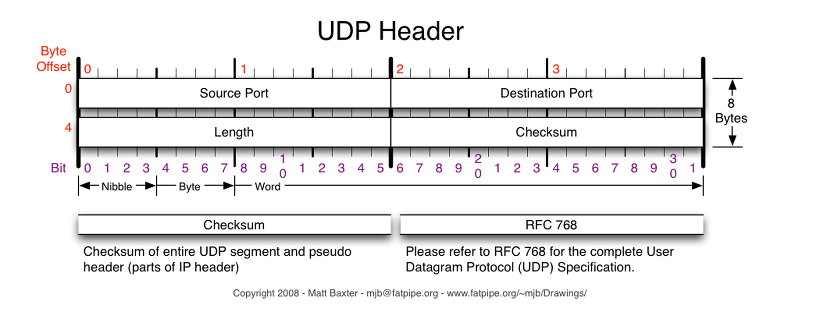

  <h1> UDP 😺 </h1>

> 발표일　　|　 2023.10.18  
> 발표자　　|　강준영  

  <h3>📇 목차 </h3>

[1. 개요](#🏭-개요) 
[2. 특징](#🌊-특징) 
[3. UDPHeader](#🦴-UDPHeader)  

 

# 🏭 개요

## UDP 통신이란?

- User Datagram Protocol의 약자로 데이터를 데이터그램 단위로 처리하는 프로토콜.
- 비연결형, 신뢰성 없는 전송 프로토콜.
- 데이터그램 단위로 쪼개면서 전송을 해야하기 때문에 전송 계층(Transport layer).

## 등장 배경

1. IP의 역할은 Host to Host (장치 to 장치)만을 지원. 장치에서 장치로 이동은 IP로 해결되지만, 하나의 장비안에서 수많은 프로그램들이 통신을 할 경우에는 IP만으로는 한계가 있음.

=> 포트 번호 등장

2. 또한, IP에서 오류가 발생한다면 ICMP에서 알려주는데, 알려주기만 할 뿐 대처를 못함. -> IP보다 위에서 처리를 해줘야 한다. (TCP, UDP 등장)

※ ICMP : 인터넷 제어 메시지 프로토콜로 네트워크 컴퓨터 위에서 돌아가는 운영체제에서 오류 메시지를 전송받는데 주로 쓰임

 

# 🌊 특징

- UDP의 결정적인 장점은 데이터의 신속성.
- 데이터의 처리가 TCP보다 빠름.

- 주로 실시간 방송과 온라인 게임에서 사용됨.

- 네트워크 환경이 안 좋을때, 끊기는 현상은 UDP를 쓴 것.

## DNS(Domain Name Service) : UDP 사용

- DNS request는 양이 작음(DNS query는 Single UDP request와 server로 부터의 single UDP reply로 구성)

-> UDP Request에 담길 수 있음

- 3 way handshaking으로 연결 유지 필요 x (오버헤드가 큼)

- 쿼리 및 응답이 비교적 간단하여 재전송 등의 추가적인 처리 필요 x

- but 크기가 512(UDP 제한)이 넘는다면 TCP 사용해야함.

- Zone transfer (DNS 서버 간 요청을 주고 받을 때 사용하는 통신 방법)을 쓸 경우 TCP 사용해야함.

 

# 🦴 UDPHeader

- Source port : 시작 포트
- Destination port : 도착지 포트
- Length : 길이
- Checksum : 오류 검출
  - 중복 검사의 한 형태로, 오류 정정을 통해 공간이나 시간 속에서 송신된 자료의 무결성을 보호하는 단순한 방법.

 

이렇게 간단하므로, TCP 보다 용량이 가볍고 송신 속도가 빠르게 작동됨.

그러나 확인 응답을 못하므로, TCP보다 신뢰도가 떨어짐.

UDP는 비연결성, TCP는 연결성으로 정의할 수 있음.

 

#### 출처

1. UDP : https://gyoogle.dev/blog/computer-science/network/UDP.html#%E1%84%83%E1%85%B3%E1%86%AF%E1%84%8B%E1%85%A5%E1%84%80%E1%85%A1%E1%84%80%E1%85%B5-%E1%84%8C%E1%85%A5%E1%86%AB
