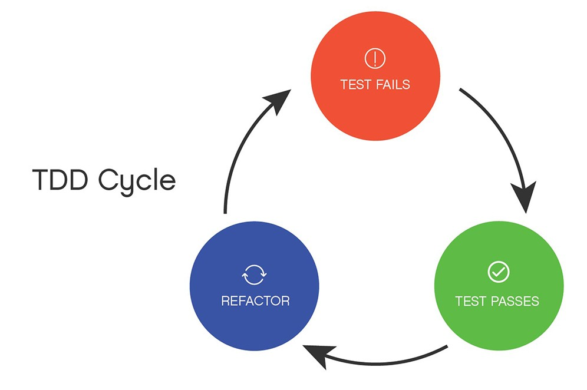

<div align=center>
  <h1> TDD 😺 </h1>
</div>

> 발표일　　|　 2023.08.30 <br />
> 발표자　　|　강준영 <br />

<div align=center>
  <h3>📇 목차 </h3>
</div>

[1. 정의](#🏭-정의)<br />
[2. 장단점](#🌊-장단점)<br />
[3. 주기](#🦴-주기) <br />
[4. Tool](#🧩-Tool) <br />

<br>

# 🏭 정의

#### Testing

```
제품이 원하는대로, 예상하는 대로 동작하는지 확인하는 것

함수, 특정한 기능, UI, 성능, API 스펙등을 점검

SW에서는 테스트코드를 작성하여 테스트 진행

테스트 프레임워크 or 라이브러리 사용 가능
```

## TDD

```
Test Driven Development
테스트 주도 개발

- 개발(코드 작성)전 테스트 코드를 먼저 작성

- 기능을 세분화해서 한 가지의 기능에 대한 테스트 코드만 작성하고, 그 테스트가 통과할 때 까지 추가적인 코드를 작성.

- success시, 다른 기능에 대한 테스트 코드를 작성하고 같은 작업 반복.

- 모든 기능 테스트 완료시 코드의 퀄리티 향상, 아키텍처 개선, 리팩토링 진행

```

<br>

# 🌊 장단점

### 장점

```
- 요구사항에 대한 철저한 분석, 이해 가능

- 설계자의 관점에서 코드 작성 가능

=> 설계 단계에서 구조적 문제 발견 시 빠르게 수정할 수 있음

- 객체지향적 코드 개발(테스트 코드 재사용성)

- 개발 집중력 향상(기능 단위로 쪼개서)

- 디버깅 시간 단축 (단위 테스트 진행 시 문제 발생 영역 쉽게 찾을 수 있음)

- 유지 보수 용이

- 테스트 근거 산출 가능
```

### 단점

```
- GUI 디자인과 같이 기능 테스트가 필요한 경우는 잘 수행되지 않음

- 개발자가 직접 단위 테스트를 작성할 때 테스트는 코드와 동일한 문제점을 공유할 수 있음.

- 테스트는 유지보수 측면의 오버헤드임. 잘못 작성된 테스트는 유지관리 or 업데이트에 더 많은 비용 발생 가능

-
```

# 🦴 주기



### Red-Green-Refactor Process

소스코드 작성 -> 단위 테스트 작성 (기존방식)

테스트코드 작성 -> 소스 코드 작성 -> 리팩토링 (TDD Cycle)

```
1. 테스트 추가하기

새로운 기능이나 업데이트된 기능에 대한 테스트 생성. 테스트를 생성하려면 개발자는 기능 사양 및 요구 사항을 이해해야함.

2. 모든 테스트 실행
테스트를 실행하면 테스트 도구가 올바르게 작동하는지 확인 + 새로 추가한 테스트 코드가 pass되는지 확인.

최초의 테스트코드는 그에 맞는 소스코드가 없기 때문에 무조건 fail -> 새 코드가 필요하다는 증명

3. 모든 테스트를 통과하는 코드 작성
이 단계에서 코드는 완벽하지 않을수도 있음.
단순히 pass만 하면 되는 코드 작성

4. 모든 테스트 실행. 테스트가 실패하면 3번째 단계로 return

모든 테스트를 통과하면 코드가 테스트 요구사항을 충족함을 증명할 수 있음.

5. 코드 리팩토링
- 네이밍 컨벤션 적용
- 중복된 코드 제거

6. 새로운 코드가 들어오면 1번째 단계에서부터 시작
```

# 🧩 Tool

## FE

```
Jest
: JavaScript 테스트 프레임워크로, React 및 Vue 같은 프론트엔드 프레임워크와 함께 많이 사용.
Snapshot 테스팅 및 비동기 코드 테스팅을 지원하며, 풍부한 기능과 커뮤니티 지원을 제공.

React Testing Library
: React 컴포넌트의 사용자 상호작용 및 렌더링을 테스트하기 위한 라이브러리.
사용자 중심 테스팅을 장려하며, UI 컴포넌트 동작을 효과적으로 테스트 가능.

Cypress
: 엔드 투 엔드 (End-to-End) 테스트 도구로, 프론트엔드 애플리케이션의 사용자 시나리오를 테스트 할 수 있음.
브라우저에서 애플리케이션을 실제로 실행하며 테스트하므로 실제 사용 환경과 유사한 조건에서 테스트 가능.
```

## BE

```
JUnit
: Java 언어를 위한 테스트 프레임워크.
Java 백엔드 애플리케이션의 단위 테스트를 작성하는 데 널리 사용됨.

TestNG
: Java 기반 테스트 프레임워크.
JUnit과 유사하지만 JUnit이 지원하지 않는 몇 가지 고급 기능과 특수 주석으로 구성.

PyTest
: 파이썬 언어를 위한 강력한 테스트 프레임워크.
간결한 문법과 풍부한 언어 기능을 활용하여 테스트를 작성 가능.
```

## 기타

```
Postman/Newman
: API 테스트를 위한 도구.
HTTP 요청 및 응답을 테스트하고 API 엔드포인트의 기능을 확인하는 데 사용됨.

Selenium
: 웹 애플리케이션의 자동화된 브라우저 테스트를 위한 프레임워크.
여러 브라우저에서 웹 애플리케이션의 동작을 테스트할 수 있음.
```

#### 출처

1. 테스트 코드와 TDD 🧪(feat. 프론트엔드, 백엔드를 위한 테스트 코드): https://www.youtube.com/watch?v=Npi21gLIEZM
2. TDD 소개 : https://m.blog.naver.com/suresofttech/221569611618
3. Test-Driven Development (TDD) – Quick Guide [2023] : https://brainhub.eu/library/test-driven-development-tdd
