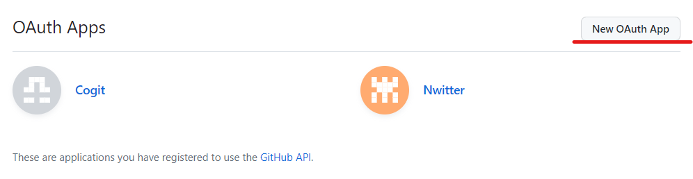
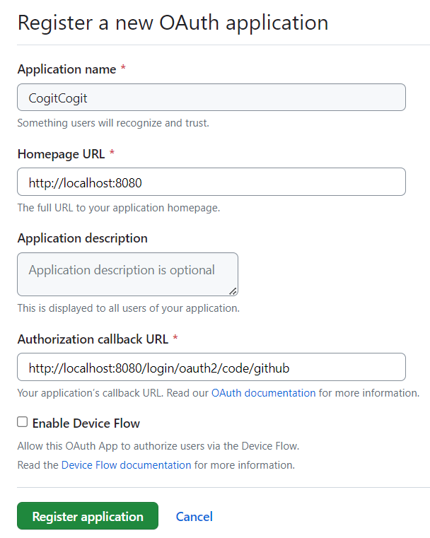
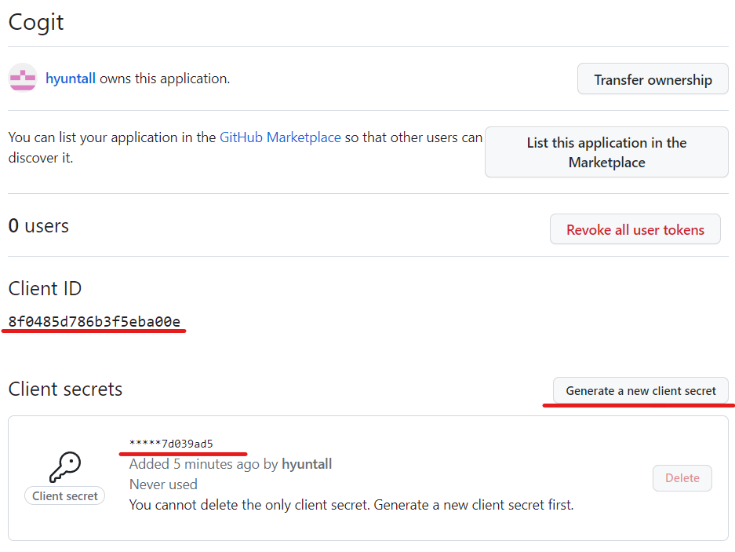

# 인증 vs 인가
---

## 인증 Authentication

사용자의 신원을 확인하는 절차
ex) 로그인 시 입력값과 DB에 저장된 값이 일치하는지


## 인가 Authorization

사용자의 요청을 실행할 수 있는 권한 여부를 확인하는 절차
ex) 해당 게시글을 수정할 수 있는지

---
# 스프링 시큐리티란?
---
스프링 시큐리티 : 인증과 인가를 제공하는 데에 초점이 맞춰진 프레임워크

### 스프링 시큐리티 구조

- 스프링 시큐리티는 아래와 같은 필터 기반으로 작동


1. Http Request 수신
-> 사용자가 로그인 정보와 함께 인증 요청

2. 유저 자격 기반 인증 토큰 생성
-> AuthenticationFilter가 요청을 가로채고, UsernamePasswordAuthenticationToken의 인증용 객체 생성

3. AuthenticationToken을 AuthenticationManager로 전달
-> AuthenticationMaganer의 구현체인 providerManager에게 전달

4. AuthenticationProvider 목록으로 인증 시도
-> AuthenticationManager는 등록된 AuthenticationProvider를 조회하며 인증 요구

5. UserDetailsService에 정보 전달
-> 실제 DB에서 사용자 인증 정보를 가져오는 userDetailsService에 사용자 정보 전달

6. UserDetails를 이용해 User객체에 대한 정보 탐색
-> DB에서 사용자 정보를 찾아 UserDetails객체 생성

7. User 객체의 정보를 UserDetailsService로 전달
-> AuthenticationProvider들은 UserDetails를 넘겨받고 사용자 정보 비교

8. 인증 객체 or AuthenticationException 반환
-> 인증 완료 시, 권한 등의 정보를 담은 Authentication 객체 반환

9. 인증 종료
-> AuthenticationFilter에 Authentication 객체 반환

10. SecurityContext에 인증 객체 설정
-> Authentication 객체를 Security Context에 저장 (인메모리 세션 저장소)

11. Client에게 Session ID와 함께 응답 전송
-> 이후 재 요청 시, 요청 쿠키에서 JEESSIONID를 전달받아서 유효하면 인증

### 스프링 시큐리티 Oauth2 클라이언트

구글, 네이버, 깃헙 등과 같은 소셜 로그인 기능으로, 적용 시 다음과 같은 기능을 직접 구현하지 않아도 된다.

- 로그인 시 인증
- 회원가입 시 이메일 혹은 전화번호 인증
- 비밀번호 찾기
- 비밀번호 변경
- 회원정보 변경

# OAuth2 Github Spring Boot 적용하기

### 1. Spring Boot Gradle 의존성 추가

```java
// auth dependencies
implementation 'org.springframework.boot:spring-boot-starter-oauth2-client'
implementation 'org.springframework.boot:spring-boot-starter-security'

// git api dependencies
implementation group: 'org.kohsuke', name: 'github-api', version: '1.125'
```

### 2. Application.yml 설정 추가

```java
## OAuth2
spring:
  security:
    oauth2:
      client:
        registration:
          github:
            client-id: client_id
            client-secret: client-secret
```

- client-id, secret 발급 받기
1. [https://github.com/settings/developers](https://github.com/settings/developers) 접속
2. New OAuth App 클릭

    
 
  
3. 서비스 URL과, API URL 입력 후, Register Application 클릭
    
 
    
4. Client ID와, Client Secret 확인

    
 


 ### springboot gradle 의존성 추가
```
// auth dependencies
implementation 'org.springframework.boot:spring-boot-starter-oauth2-client'
implementation 'org.springframework.boot:spring-boot-starter-security'

// git api dependencies
implementation group: 'org.kohsuke', name: 'github-api', version: '1.125'
```

### application.yml 설정 추가

```
## OAuth2
spring:
  security:
    oauth2:
      client:
        registration:
          github:
            client-id: client_id
            client-secret: client-secret
```


### SecurityConfig.java

```
@Override
    protected void configure(HttpSecurity http) throws Exception {
        System.out.println("configure 호출됨");
        http.csrf().disable() // h2 console 접속을 위해
                .headers().frameOptions().disable() // h2 console 접속을 위해
                .and()
                .oauth2Login() // OAuth2 로그인 설정 시작점
                .userInfoEndpoint() // OAuth2 로그인 성공 이후 사용자 정보를 가져올 때 설정 담당
                .userService(oAuthService); // OAuth2 로그인 성공 시, 후작업을 진행할 UserService 인터페이스 구현체 등록
    }
```

### OAuthService.java

```
    @Override
    public OAuth2User loadUser(OAuth2UserRequest userRequest) throws OAuth2AuthenticationException {
        OAuth2UserService delegate = new DefaultOAuth2UserService();
        OAuth2User oAuth2User = delegate.loadUser(userRequest); // OAuth 서비스(github, google, naver)에서 가져온 유저 정보를 담고있음

        String registrationId = userRequest.getClientRegistration()
                .getRegistrationId(); // OAuth 서비스 이름(ex. github, naver, google)
        String userNameAttributeName = userRequest.getClientRegistration().getProviderDetails()
                .getUserInfoEndpoint().getUserNameAttributeName(); // OAuth 로그인 시 키(pk)가 되는 값
        Map<String, Object> attributes = oAuth2User.getAttributes(); // OAuth 서비스의 유저 정보들

        UserProfile userProfile = OAuthAttributes.extract(registrationId, attributes); // registrationId에 따라 유저 정보를 통해 공통된 UserProfile 객체로 만들어 줌

        Member member = saveOrUpdate(userProfile); // DB에 저장

        return new DefaultOAuth2User(
                Collections.singleton(new SimpleGrantedAuthority(member.getRoleKey())),
                attributes,
                userNameAttributeName);
    }
```
