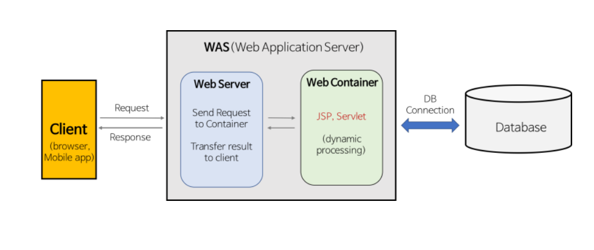

## Static vs Dynamic 페이지

### 정적 페이지

- 데이터베이스에서 정보를 가져오거나 등 별도의 서버에서의 처리가 없어도, 사용자들에게 보여줄 수 있는 페이지.
- 어떠한 사용자가 오던간에 동일한 페이지를 보여준다.

### 동적 페이지

- 서버에서 데이터베이스에서 정보를 가져와서 처리하는 것처럼, 어떠한 요청에 의하여 서버가 일을 수행하고 해당 결과가 포함된 파일을 보여주는 페이지.
- 사용자들마다 다른 페이지가 보여질 수 있다.

## Web Server와 WAS의 차이

### Web Server

- 클라이언트가 요청한 정적인 콘텐츠를 HTTP 프로토콜을 통하여 제공해주는 서버
- 정적 페이지를 보내준다.
- 동적인 요청이 클라이언트로부터 들어왔을 때 컨테이너로 보내준다.

ex) Nginx, Appach HTTP Server, IIS

### 웹 컨테이너

- 동적인 데이터들을 처리하여 정적인 페이지로 생성해주는 소프트웨어 모듈.
- Java에서의 서블릿.

### 웹 컨테이너의 작동

1. 클라이언트는 웹서버로 request(요청)을 보낸다.

2. 서블릿을 포함하는 WAS는 컨테이너로 요청을 보낸다.

3. 컨테이너가 요청을 각 서블릿에게 전달한다.

4. 서블릿 메서드가 로드된다.

5. 서블릿은 컨테이너에 관련 response(응답)을 넘겨준다.

6. 컨테이너는 이를 서버에 전달한다. 서버는 응답을 클라이언트에게 전달한다.

### WAS(Web Application Server)

- 웹 서버와 컨테이너를 붙여놓은 서버

### Web Server가 필요한 이유

- Web Server에서는 정적 컨텐츠만 처리하도록 기능을 분배하여 서버의 부담을 줄일 수 있다.

### WAS가 필요한 이유

- WAS를 통해 요청에 맞는 데이터를 DB에서 가져와서 비즈니스 로직에 맞게 그때 그때 결과를 만들어서 제공함으로써 자원을 효율적으로 사용할 수 있다.

### Web Server + WAS 조합

- 웹 서버와 WAS를 분리!

1. 기능을 분리하여 서버 부하 방지

- WAS는 DB 조회나 다양한 로직을 처리하느라 바쁘기 때문에 단순한 정적 컨텐츠는 Web Server에서 빠르게 클라이언트에 제공하는 것이 좋다.

- WAS는 기본적으로 동적 컨텐츠를 제공하기 위해 존재하는 서버이다.

- 만약 정적 컨텐츠 요청까지 WAS가 처리한다면 정적 데이터 처리로 인해 부하가 커지게 되고, 동적 컨텐츠의 처리가 지연됨에 따라 수행 속도가 느려진다.

2. 물리적으로 분리하여 보안 강화

- SSL에 대한 암복호화 처리에 Web Server를 사용

 
3. 여러 대의 WAS를 연결 가능

- fail over(장애 극복), fail back 처리에 유리

- 특히 대용량 웹 어플리케이션의 경우(여러 개의 서버 사용) Web Server와 WAS를 분리하여 무중단 운영을 위한 장애 극복에 쉽게 대응할 수 있다.

- 예를 들어, 앞 단의 Web Server에서 오류가 발생한 WAS를 이용하지 못하도록 한 후 WAS를 재시작함으로써 사용자는 오류를 느끼지 못하고 이용할 수 있다.

​
4. 여러 웹 어플리케이션 서비스 가능

- 예를 들어, 하나의 서버에서 PHP Application과 Java Application을 함께 사용하는 경우
